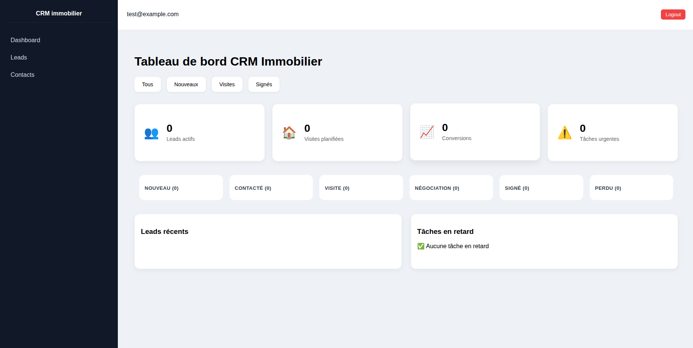

# CRM Immobilier – Symfony & Angular

<p align="center">


</p>

Application CRM immobilier full-stack développée dans une logique proche production.

Le projet simule un environnement métier réel :
gestion de prospects, authentification sécurisée, protection des accès, dashboard métier et architecture API découplée.

Projet construit progressivement avec une approche orientée :
- architecture propre,
- sécurité,
- maintenabilité,
- UX métier,
- séparation frontend/backend.

## Fonctionnalités implémentées

### Backend Symfony API
- API REST Symfony 7
- Authentification JWT
- Sécurisation des endpoints
- Gestion des rôles (`ROLE_ADMIN`, `ROLE_USER`)
- Voters Symfony pour contrôle d’accès métier
- Relations utilisateurs ↔ leads
- API JSON structurée
- Architecture orientée services

### Frontend Angular
- Application Angular standalone
- Login sécurisé connecté à l’API
- Gestion centralisée du JWT
- HTTP Interceptor
- Route Guards
- Dashboard protégé
- Gestion d’état utilisateur
- UX orientée CRM immobilier

### Dashboard CRM
- Affichage des leads récents
- KPIs métier
- Pipeline visuel
- Statuts colorés
- Cartes statistiques
- Interface responsive

---

## Aperçu

### Dashboard CRM

Interface du dashboard CRM immobilier (version actuelle)

<p align="center">
  
</p>

---

## Stack technique

### Backend
- PHP 8.3
- Symfony 7
- API Platform (exposition des endpoints REST + sérialisation)
- JWT Authentication
- PostgreSQL
- PostGIS

### Frontend
- Angular (standalone, RxJS, TypeScript)

### Infrastructure
- Docker
- Docker Compose
- Nginx

### Outils
- Git
- GitHub
- Composer
- npm

---

## Architecture du projet

```txt
crm-immo/
├── backend/      → API Symfony
├── frontend/     → Application Angular
├── docker/       → Configuration Nginx
└── docker-compose.yml
```

--- 

## Sécurité implémentée

### Authentification
- Login JWT sécurisé
- Token Bearer
- Interceptor Angular
- Routes protégées

### Autorisations
- Voters Symfony
- Contrôle d’accès par propriétaire
- Gestion des rôles
- Protection des endpoints sensibles

---

## Progression du projet

Le développement du projet a été construit progressivement avec une montée en complexité continue :

- Mise en place infrastructure Docker
- Création API Symfony
- Authentification JWT
- Sécurisation des endpoints
- Implémentation des Voters Symfony
- Mise en place Guards & Interceptors
- Développement frontend Angular
- Création du dashboard CRM
- Amélioration UX métier immobilier

---

## Lancement du projet

Dans un terminal backend:
### Docker

```bash
docker compose up -d --build
```
Dans un terminal frontend:
### Angular
```bash
ng serve
```

---

## Accès

| Service | URL |
|---|---|
| Frontend Angular | http://localhost:4200 |
| API Symfony | http://localhost:8080 |
| PostgreSQL | via Docker |

---

## État actuel du projet

Le projet dispose actuellement :
- d’une architecture full-stack fonctionnelle,
- d’une API sécurisée par JWT,
- d’un frontend Angular connecté,
- d’une base CRM exploitable,
- d’une séparation claire frontend/backend,
- d’une première UX métier orientée immobilier.

---

## Roadmap

### Backend
- CRUD complet des leads
- Gestion des biens immobiliers
- Pagination / filtres
- Validation avancée
- Tests automatisés

### Frontend
- Gestion complète des leads
- Formulaires dynamiques
- Pipeline Kanban
- Recherche et filtres
- Responsive mobile avancé

### DevOps
- CI/CD
- Monitoring (à venir...)
- Logs centralisés
- Environnement staging

---

## Objectif du projet

Ce projet sert de démonstration de compétences full-stack dans un environnement proche production :

- architecture API moderne,
- sécurisation applicative,
- Angular + Symfony,
- logique métier CRM,
- bonnes pratiques de développement,
- séparation des responsabilités,
- UX métier.

---

## Repository GitHub

https://github.com/Shoshin-Dev-Ivy/crm-immo